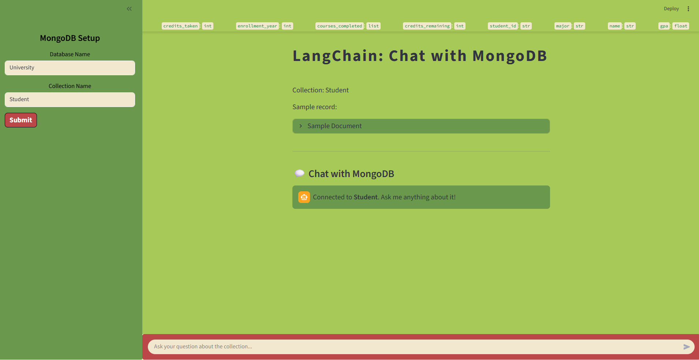
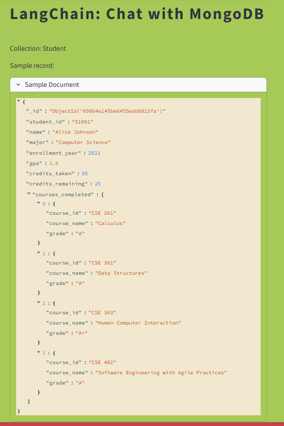
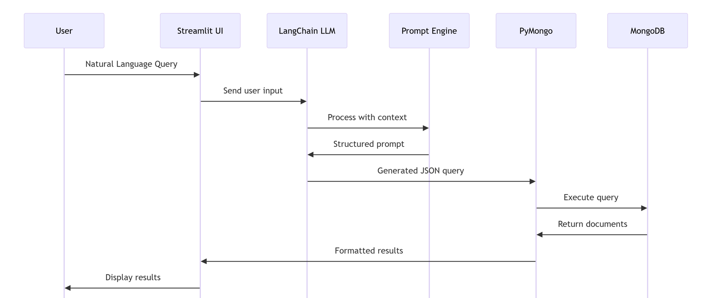
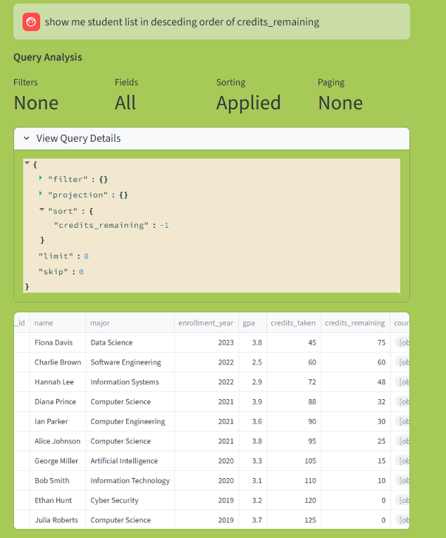
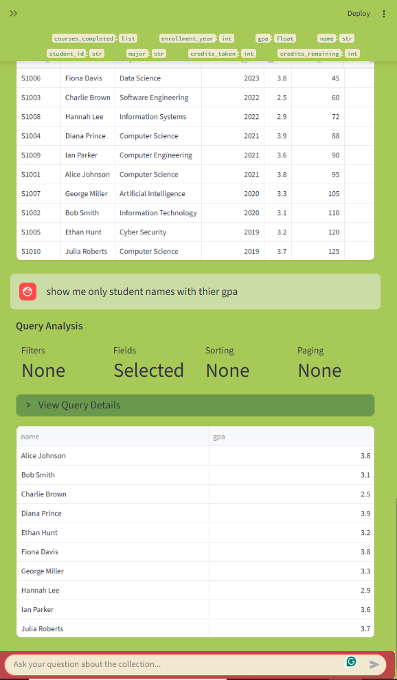

## Project photos

- Landing page before connecting to mongoDB
- 

- After sucessful connection
- 

- First query result 
- 

- Technical Flow
- 

- Second query result
- 

- Query result format
- 

- Responsive UI
- 

## 🐳 Docker Setup

#### Step 1: Install Docker Desktop
- Download from [docker.com](https://www.docker.com/products/docker-desktop/)
- Install and restart your computer

#### Step 2: Set up Environment Variables
- Edit .env with your actual credentials of mongouri and GROQ API
- Get the groq API from here ["https://console.groq.com/home"]

#### Step 3 : Initialize the Database
```bash
docker-compose run --rm mongoquery-ai python connect.py
```

#### Step 4 : Run and access the streamlit application
```bash
docker-compose up --build
```
- To access your website go to [http://localhost:8501](http://localhost:8501)

#### To stop the application 
```bash
docker-compose down
```
